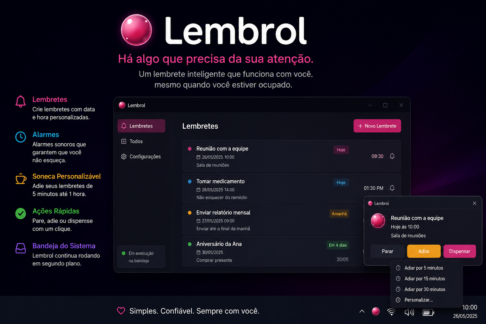

# Lembrol --- Project Manager

A modern task and project management application with a magical visual
identity inspired by the idea of the Lembrol: a small object that
changes its behavior to remind you when something needs your attention.

## Preview



## About

Lembrol is a React-based project and task manager focused on keeping
projects organized while providing clear visual and notification-based
reminders.

The application combines a dark, magical-inspired interface with an
animated Lembrol orb whose color reflects the current state of pending
tasks.

## Features

- Create and manage projects.
- Add tasks to projects.
- Define due dates and times.
- Configure task reminders.
- Set task priorities.
- Edit and delete tasks.
- Mark tasks as completed.
- Track project progress.
- Visual task status through the animated Lembrol orb.
- Automatic reminder notifications.
- Reminder sound alerts.
- Notification panel accessible through the bell button.
- Portuguese (Brazil) and English (US) interface.
- Persistent reminder state.
- Responsive dark-themed interface.

## Lembrol Status

The Lembrol orb changes according to the state of the user's tasks:

- 🟢 **Calm** --- Everything is in order.
- 🟡 **Warning** --- A task is approaching its due date.
- 🔴 **Alert** --- Something needs your attention.

Completed tasks do not trigger warning or alert states.

## Tech Stack

- React
- JavaScript
- Vite
- Tailwind CSS
- Web Audio API
- Local storage for persistence

## Current Version

**v0.1.0 --- Initial development release**

This version represents the first functional milestone of the project.
The core project, task, reminder, notification, localization, and visual
identity features are in place.

## Running the Project

Install the dependencies:

```bash
npm install
```

Start the development server:

```bash
npm run dev
```

Then open the local address provided by Vite in your browser.

## Project Status

🚧 **In active development**

Lembrol v0.1.0 is an initial development milestone. More features,
refinements, and improvements will be added in future versions.

---

**Lembrol --- Tudo em ordem.**
